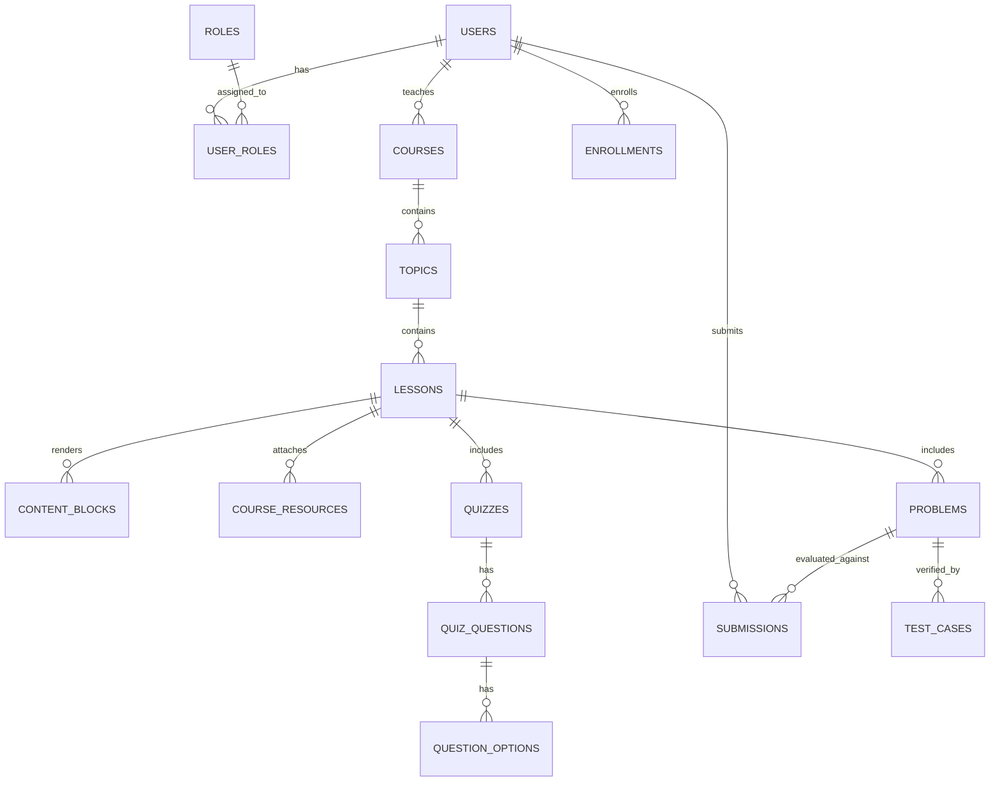

# CodeCraft — Complete Engineering & Code Manual

---

## 1. System Overview & Technology Stack

CodeCraft is structured as a decoupled client-server web application with isolated code compilation and evaluation sandboxing:

### Backend Stack
* **Runtime**: Java 21 LTS
* **Framework**: Spring Boot 3.3.x (Spring MVC, Spring Data JPA, Spring Security 6)
* **Database**: MySQL 8.x (managed with Flyway incremental migrations)
* **Build System**: Apache Maven 3.9.x
* **Security & Auth**: Stateless JWT (HS256 via `jjwt`), BCrypt password hashing (strength 12)
* **Execution Sandbox**: Dedicated worker with process limits, timeout watchdog, and restricted file permissions

### Frontend Stack
* **Runtime & Bundler**: Node.js & Vite 5.x
* **Framework**: React 18 (TypeScript 5.x)
* **Routing**: React Router DOM 6.x (with dedicated `StudentProtectedRoute` and `ManagementRoute`)
* **Styling**: Tailwind CSS 3.x, Radix UI primitives, Lucide React icons
* **Code Editor**: Microsoft Monaco Editor (`@monaco-editor/react`)
* **State Management**: TanStack React Query v5 (server-state caching) & React Context (auth session)
* **HTTP Client**: Axios with interceptors for token injection and error handling

---

## 2. Repository Directory Structure

```
B:/mrk/
├── .gitignore
├── README.md
├── USER_MANUAL.md
├── CODE_MANUAL.md
├── backend/
│   ├── pom.xml
│   └── src/
│       ├── main/
│       │   ├── java/com/codecraft/
│       │   │   ├── CodeCraftApplication.java
│       │   │   ├── common/             # Exceptions, ApiResponse wrapper, ErrorResponse
│       │   │   ├── config/             # SecurityConfig, WebMvcConfig, SuperAdminBootstrapRunner, Importers
│       │   │   ├── domain/
│       │   │   │   ├── admin/          # Admin stats, teacher provisioning controller & service
│       │   │   │   ├── auth/           # Login, Register, Me controller, DTOs, service
│       │   │   │   ├── course/         # Course, Module, Lesson, ContentBlock entities, repos, services
│       │   │   │   ├── enrollment/     # Course enrollments, progress calculation
│       │   │   │   ├── problem/        # Problem, TestCase entities, runner, DTOs
│       │   │   │   ├── quiz/           # Quiz, Question, Option, AttemptAnswer entities & service
│       │   │   │   ├── submission/     # Code submission, evaluation pipeline
│       │   │   │   └── user/           # User, Role entities and repositories
│       │   │   └── security/           # JwtTokenProvider, UserPrincipal, CustomUserDetailsService
│       │   └── resources/
│       │       ├── application.yml     # Central configuration (DB, JWT, Sandbox, Bootstrap)
│       │       └── db/migration/       # Flyway schema scripts (V1 through V5)
│       └── test/                       # Controller and repository integration tests
└── frontend/
    ├── index.html
    ├── package.json
    ├── vite.config.ts
    ├── tailwind.config.js
    ├── public/                         # Served static assets (favicon.png, logo.png)
    └── src/
        ├── app/                        # App.tsx, routes.tsx
        ├── assets/                     # Packaged brand images
        ├── components/
        │   ├── auth/                   # StudentProtectedRoute.tsx, TeacherProtectedRoute.tsx
        │   ├── layout/                 # AppShell, Navbar, Footer
        │   └── ui/                     # Button, Badge, Card, Input
        ├── features/
        │   ├── admin/                  # ManagementRoute, ManagementLoginPage, AdminPage (Super Admin)
        │   ├── auth/                   # LoginPage, RegisterPage (Learners)
        │   ├── courses/                # CourseListPage, CourseDetailPage, LessonViewPage
        │   ├── dashboard/              # DashboardPage (Student metrics)
        │   ├── landing/                # LandingPage (Hero, IDE Showcase, Track Grid)
        │   ├── problems/               # ProblemListPage, ProblemWorkspacePage (Monaco IDE)
        │   ├── profile/                # ProfilePage
        │   ├── progress/               # ProgressPage
        │   ├── quizzes/                # QuizPage
        │   └── teacher/                # TeacherDashboardPage, CourseBuilderPage
        ├── hooks/                      # useAuth.tsx, custom utility hooks
        ├── lib/                        # axios.ts, api client services (adminApi, teacherApi, courseApi)
        ├── types/                      # TypeScript definitions (auth, course, teacher, admin, problem)
        └── styles/                     # index.css (Tailwind theme variables)
```

---

## 3. Database Schema & Flyway Migrations

Database evolution is tracked via Flyway versioned migration scripts located in `backend/src/main/resources/db/migration/`:

```
V1__init_schema.sql                      -> Core tables: users, roles, courses, topics, lessons, problems, submissions
V2__seed_roles_and_achievements.sql      -> Initial role seeds and achievement metadata
V3__add_indexes_and_cleanup.sql          -> Query performance indexing and foreign keys
V4__admin_teacher_cms_schema.sql         -> Content blocks, course resources, teacher_id ownership, quiz attempts
V5__clean_three_role_model.sql           -> Stripped legacy ROLE_ADMIN; established strict 3-role model
```

### 3.1 Entity Relationship Diagram



### 3.2 Canonical Roles
1. **`ROLE_STUDENT`**: Default assigned to any self-registered learner.
2. **`ROLE_TEACHER`**: Assigned exclusively to faculty members provisioned by the Super Admin.
3. **`ROLE_SUPER_ADMIN`**: Assigned to the platform owner bootstrap account.

---

## 4. Security & Access Control Architecture

### 4.1 Authentication Flow
* **Stateless JWT Tokens**: Tokens are issued upon `POST /api/auth/login` and signed using HS256.
* **Payload Structure**:
  * `sub`: Subject username
  * `userId`: Database ID
  * `roles`: Array of granted authorities (e.g. `["ROLE_SUPER_ADMIN", "ROLE_TEACHER"]`)
  * `iat` and `exp`: 24-hour expiration lifecycle
* **Case-Insensitive Resolution**: User lookups call `userRepository.findByUsernameIgnoreCaseOrEmailIgnoreCase(trimmed, trimmed)`.

### 4.2 Endpoint Authorization Matrix

| Endpoint Pattern | Allowed Roles | Enforced By | Failure Status |
| :--- | :--- | :--- | :--- |
| `/api/auth/register`, `/api/auth/login` | Public (Permit All) | `SecurityConfig` | 400 Bad Request / 401 Unauthorized |
| `/api/auth/me` | Authenticated (`STUDENT`, `TEACHER`, `SUPER_ADMIN`) | `SecurityConfig` | 401 Unauthorized |
| `GET /api/courses/**`, `GET /api/problems/**` | Public (Published only) | `SecurityConfig` | 404 Not Found |
| `/api/admin/**` | `ROLE_SUPER_ADMIN` strictly | `SecurityConfig` + `@PreAuthorize("hasRole('SUPER_ADMIN')")` | 403 Forbidden |
| `/api/teacher/**` | `ROLE_TEACHER`, `ROLE_SUPER_ADMIN` | `SecurityConfig` + `@PreAuthorize("hasAnyRole('TEACHER', 'SUPER_ADMIN')")` | 403 Forbidden |
| `/api/submissions/**`, `/api/enrollments/**` | Authenticated (`STUDENT`, `TEACHER`, `SUPER_ADMIN`) | `SecurityConfig` | 401 Unauthorized / 403 Forbidden |

### 4.3 Data Isolation & Anti-IDOR Protections
* **Teacher Course Ownership**:
  ```java
  private boolean isOwnerOrAdmin(Course course, User user) {
      if (user == null) return false;
      boolean isSuperAdmin = user.getRoles().stream()
              .anyMatch(r -> "ROLE_SUPER_ADMIN".equals(r.getName()));
      if (isSuperAdmin) return true;
      return course.getTeacher() != null && course.getTeacher().getId().equals(user.getId());
  }
  ```
  A teacher attempting to update another instructor's course receives HTTP 403.
* **Hidden Test Case Exposure Prevention**: Public problem DTOs (`PublicProblemDto`) omit secret evaluation test cases and expected outputs.
* **Quiz Answer Secrecy**: Correct answers (`is_correct`) are stripped from public quiz queries before student submission.

---

## 5. Code Execution Sandbox Architecture

The execution engine evaluates untrusted user-submitted code in an isolated sub-second execution environment:

```
  [User Submission] ──▶ [SubmissionService]
                              │
                              ▼
                     [CodeExecutionEngine]
                              │
      ┌───────────────────────┴───────────────────────┐
      │  Isolation Boundaries:                        │
      │  • ProcessBuilder unprivileged process        │
      │  • Network: Egress completely disabled        │
      │  • Timeout: 2000ms watchdog enforcement       │
      │  • Memory Limit: 256MB JVM heap ceiling       │
      │  • File Access: Temporary scratch directory   │
      │  • Bounded stdout/stderr truncation           │
      └───────────────────────┬───────────────────────┘
                              │
                              ▼
                    [Evaluation Diff Engine]
                              │
                              ▼
            [Score, Runtime Telemetry & Verdict]
```

---

## 6. Core API Specifications

### 6.1 Authentication API (`/api/auth`)

#### `POST /api/auth/login`
Authenticates a user and returns a JWT Bearer token.
* **Request Body** (Jackson aliases accept `usernameOrEmail`, `email`, or `username`):
  ```json
  {
    "usernameOrEmail": "Sanju@gmail.com",
    "password": "San!@#ju123"
  }
  ```
* **Response (200 OK)**:
  ```json
  {
    "success": true,
    "message": "Login successful",
    "data": {
      "accessToken": "eyJhbGciOiJIUzI1NiJ9...",
      "tokenType": "Bearer",
      "user": {
        "id": 6,
        "username": "SanjuAdmin",
        "email": "Sanju@gmail.com",
        "fullName": "Sanju Kumar",
        "roles": ["ROLE_SUPER_ADMIN", "ROLE_TEACHER"]
      }
    }
  }
  ```

#### `GET /api/auth/me`
Returns the currently authenticated user principal.
* **Headers**: `Authorization: Bearer <token>`
* **Response (200 OK)**: User profile and granted roles.
* **Response (401 Unauthorized)**: Clean JSON error if token is missing or expired.

---

### 6.2 Teacher Course CMS API (`/api/teacher`)

#### `GET /api/teacher/courses`
Returns all courses authored by the authenticated instructor (or all courses if requested by Super Admin).

#### `POST /api/teacher/courses`
Creates a new course draft.
* **Request Body**:
  ```json
  {
    "title": "Distributed Systems with Java 21",
    "slug": "distributed-systems-java",
    "description": "Master consensus algorithms and actor models.",
    "category": "Backend",
    "level": "ADVANCED",
    "estimatedDuration": "8 weeks",
    "iconUrl": "server"
  }
  ```

#### `POST /api/teacher/courses/{courseId}/modules`
Adds a module to a course track.

#### `POST /api/teacher/courses/{courseId}/modules/{moduleId}/lessons`
Adds a lesson to a module.

#### `POST /api/teacher/courses/{courseId}/lessons/{lessonId}/blocks`
Appends an ordered learning block to a lesson.
* **Supported Block Types**: `TEXT`, `VIDEO`, `LINK`, `CODE`, `QUESTION`
* **Request Body Example (YouTube Embed with Attribution)**:
  ```json
  {
    "contentType": "VIDEO",
    "displayOrder": 1,
    "videoUrl": "https://www.youtube.com/watch?v=yRPqlFP3nHg",
    "videoProvider": "YOUTUBE",
    "videoDurationSeconds": 1800,
    "attribution": "Apna College"
  }
  ```

#### `PATCH /api/teacher/courses/{courseId}/publish`
Validates course modules and marks status as `PUBLISHED`.

---

### 6.3 Super Admin Platform Governance API (`/api/admin`)

#### `GET /api/admin/stats`
Returns system telemetry across users, teachers, courses, problems, and quizzes.

#### `POST /api/admin/teachers`
Provisions a new faculty account.
* **Request Body**:
  ```json
  {
    "fullName": "Dr. Leslie Lamport",
    "username": "leslie_lamport",
    "email": "lamport@acm.org",
    "password": "FacultySecurePassword123!",
    "bio": "Turing Award Laureate & Distributed Systems Pioneer"
  }
  ```

#### `PATCH /api/admin/teachers/{teacherId}/toggle-status`
Suspends or activates an instructor account.

---

## 7. Frontend Routing & Guard Architecture

Route access is managed by two dedicated router guard components in `frontend/src/app/routes.tsx`:

### 7.1 `StudentProtectedRoute` (`src/components/auth/StudentProtectedRoute.tsx`)
* Protects learner-only surfaces (`/dashboard`, `/progress`, `/profile`, `/lessons/:id`).
* If unauthenticated, safely redirects to `/login` preserving target return URL.

### 7.2 `ManagementRoute` (`src/features/admin/ManagementRoute.tsx`)
* Dedicated entry point for `/admin`.
* **Never redirects unauthenticated visitors to `/login`**.
* Direct Dispatch Logic:
  ```tsx
  if (isLoading) return <LoadingSpinner />;
  if (!isAuthenticated || !user) return <ManagementLoginPage />;
  if (isSuperAdmin) return <SuperAdminDashboardPage />;
  if (isTeacher) return <TeacherDashboardPage />;
  return <ManagementAccessDenied user={user} />;
  ```

---

## 8. Build, Testing & Deployment Guide

### 8.1 Prerequisites
* Java Development Kit (JDK 21 LTS)
* Apache Maven 3.9+
* Node.js 18+ & npm 9+
* MySQL 8.0+

### 8.2 Environment Variables
Configure the following runtime environment variables:

| Variable Name | Description | Example / Default |
| :--- | :--- | :--- |
| `SERVER_PORT` | Spring Boot HTTP port | `8080` |
| `DB_HOST` | MySQL database host | `localhost` |
| `DB_PORT` | MySQL port | `3306` |
| `DB_NAME` | Database name | `codecraft_db` |
| `DB_USERNAME` | Database username | `root` |
| `DB_PASSWORD` | Database password | `` |
| `JWT_SECRET` | 256-bit hexadecimal signing key | `${JWT_SECRET}` |
| `SUPER_ADMIN_PASSWORD` | Initial bootstrap password | `${SUPER_ADMIN_PASSWORD}` |
| `CORS_ALLOWED_ORIGINS`| Allowed client URLs | `http://localhost:5173,http://localhost:80` |

### 8.3 Compilation & Testing
```powershell
# 1. Compile and test Backend
cd B:\mrk\backend
mvn clean test

# 2. Build Frontend
cd B:\mrk\frontend
npm run build
```

### 8.4 Production Deployment Checklist
1. Verify Flyway migrations run cleanly up to `V5__clean_three_role_model.sql`.
2. Ensure `SUPER_ADMIN_PASSWORD` is supplied via secure secret management.
3. Serve frontend static assets from `frontend/dist/` behind Nginx or Caddy with SPA fallback (`try_files $uri /index.html;`).
4. Proxy all `/api/` traffic to the Spring Boot backend on port 8080.
