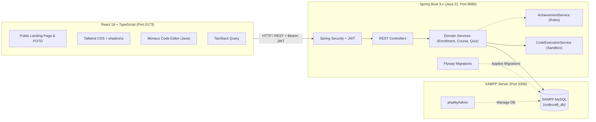

# CodeCraft — Full-Stack Interactive Learning & Code Evaluation Platform

[](https://www.oracle.com/java/)
[](https://spring.io/projects/spring-boot)
[](https://spring.io/projects/spring-security)
[](https://www.apachefriends.org/)
[](https://flywaydb.org/)
[](https://react.dev/)
[](https://tailwindcss.com/)
[](https://microsoft.github.io/monaco-editor/)

**CodeCraft** is an enterprise-grade full-stack interactive learning and competitive programming platform built with clean layered architecture, enterprise security, isolated sandbox code execution (Java first), automated assessment quizzes, and comprehensive progress tracking.

> [!IMPORTANT]
> **Database Environment**: CodeCraft uses **XAMPP MySQL** (`localhost:3306`, `codecraft_db`) for local development. MySQL is **intentionally NOT containerized**. Docker is optional.

---

## 📑 Architecture & Technical Documentation

All detailed architectural specifications are maintained in the [`docs/`](file:///e:/mrk/docs) directory:

1. [**Product Requirements Document (PRD)**](file:///e:/mrk/docs/requirements.md) — Product requirements, user personas, V1/V2/V3 release scope.
2. [**System & Component Architecture**](file:///e:/mrk/docs/architecture.md) — Layered architecture, `CodeExecutionService` sandbox abstraction, `AchievementService` rules, and frontend routing.
3. [**Database Design & XAMPP Setup**](file:///e:/mrk/docs/database.md) — ER diagram, `Enrollment` entity, Problem specifications, XAMPP/phpMyAdmin setup, and Flyway migrations.
4. [**REST API Specification**](file:///e:/mrk/docs/api.md) — Complete endpoint catalog, DTO contracts, Problem of the Day, and Swagger OpenAPI docs.
5. [**Security Architecture & Threat Model**](file:///e:/mrk/docs/security.md) — JWT lifecycle, BCrypt hashing, Spring Security 6 RBAC, and sandbox security controls.
6. [**Testing Strategy**](file:///e:/mrk/docs/testing.md) — Multi-tier testing with REST API integration tests, JUnit 5/Mockito, and Playwright E2E suites.
7. [**Deployment & DevOps**](file:///e:/mrk/docs/deployment.md) — Optional Docker Compose architecture (external XAMPP DB), multi-stage Dockerfiles, and `.env.example`.
8. [**Development Roadmap & Governance**](file:///e:/mrk/docs/roadmap.md) — Phased release roadmap (V1, V2, V3), Agent responsibility matrix, Definition of Done, and Risk register.

---

## 🏗️ Architecture Overview



---

## 🚀 Key Features

- 🌟 **Public Landing Page**: Modern developer-centric landing page featuring course highlights, interactive code preview, and the **Problem of the Day**.
- 🎓 **Course Enrollment & LMS**: Hierarchical Course $\rightarrow$ Topic $\rightarrow$ Lesson system with `Enrollment` tracking and rich Markdown rendering.
- 👨‍💻 **Java Coding Problems & Monaco Editor**: Java 21 support with starter code templates, problem constraints, execution limits, and instant dry-run evaluation.
- 🛡️ **Code Execution Sandbox Abstraction**: `CodeExecutionService` providing safe isolated code execution with 2.0s watchdogs and memory bounds.
- 📝 **Automated Quiz Engine**: Multiple-choice assessment quizzes with instant automated scoring, timer, and detailed answer explanations.
- 🏆 **Rule-Driven Achievement Engine**: `AchievementService` automatically unlocking badges based on real database activity records.
- 📊 **Real-Time Progress Dashboard**: Solved problems difficulty breakdown, streak tracking, and 365-day activity heatmaps derived directly from real activity data.
- 🛠️ **Administrative Portal**: Complete authoring suite for courses, lessons, coding challenges, public & hidden test cases, quizzes, and global submission auditing.

---

## 🚦 Local Development Quickstart (Zero-Docker Workflow)

### 1. Prerequisites
- **Java 21 JDK** installed and on `PATH`
- **Node.js 20+ & npm**
- **XAMPP** (Apache & MySQL)

### 2. Database Setup (XAMPP)
1. Open **XAMPP Control Panel**.
2. Click **Start** for **Apache** and **MySQL**.
3. Open `http://localhost/phpmyadmin` in your browser.
4. Click **New** $\rightarrow$ Create database named `codecraft_db` (`utf8mb4_unicode_ci`).

### 3. Start Backend
```bash
cd backend
./mvnw spring-boot:run
```
- Flyway automatically runs database migrations on startup.
- REST API: `http://localhost:8080/api`
- Swagger OpenAPI: `http://localhost:8080/swagger-ui/index.html`

### 4. Start Frontend
```bash
cd frontend
npm install
npm run dev
```
- Frontend Web App: `http://localhost:5173`
