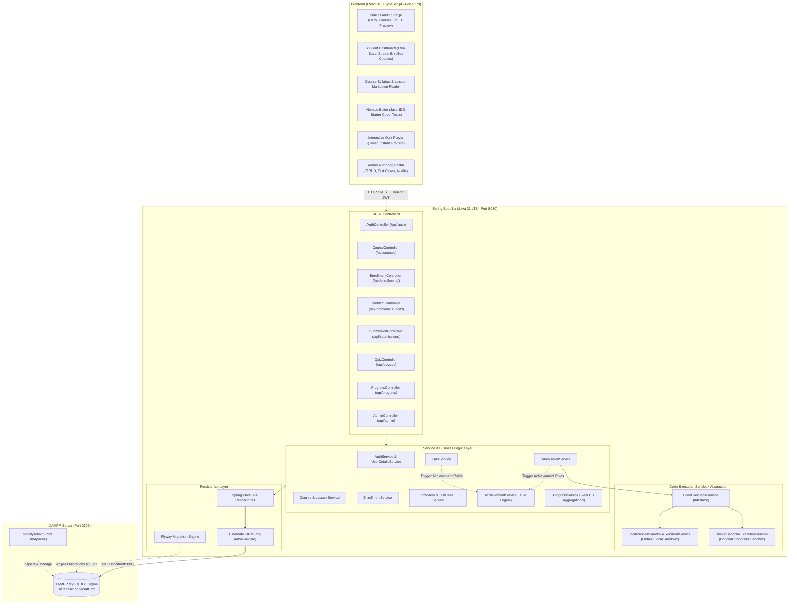
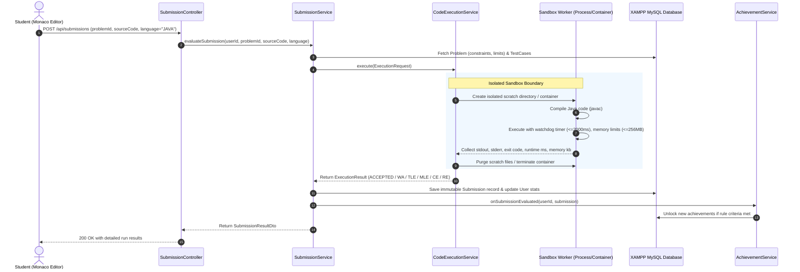
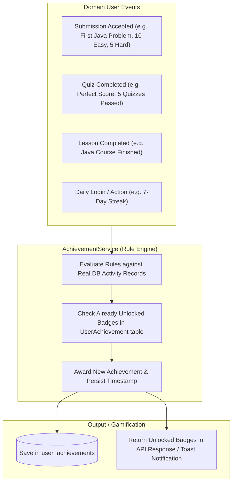
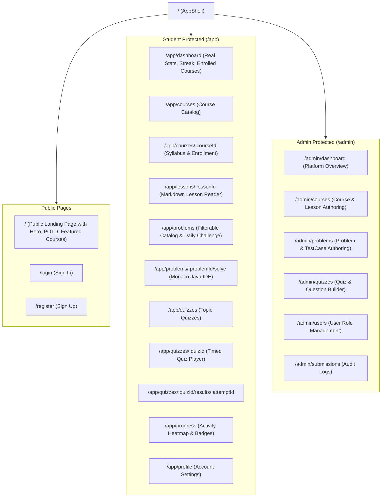

# CodeCraft — System Architecture & Technical Design

## 1. High-Level Architecture Overview

CodeCraft is built on a clean layered architecture with a decoupled React SPA frontend, a Spring Boot 3.x backend, a local **XAMPP MySQL** database, and a pluggable sandbox execution engine.



---

## 2. Versioned Architecture Strategy (V1, V2, V3)

```mermaid
graph LR
    subgraph V1 ["Version 1: Core Platform MVP"]
        V1_Auth["JWT Auth & RBAC"]
        V1_LMS["Courses, Topics, Lessons & Enrollments"]
        V1_POTD["Problem of the Day"]
        V1_Java["Java Coding Engine (Monaco + Sandbox Abstraction)"]
        V1_Quiz["Quizzes with Auto-Grading"]
        V1_Landing["Public Landing Page"]
        V1_XAMPP["XAMPP MySQL + Flyway"]
    end

    subgraph V2 ["Version 2: Gamification & Polish"]
        V2_Achieve["AchievementService (Event-Driven Rules)"]
        V2_Heatmap["365-Day Activity Heatmap"]
        V2_Search["Multi-Factor Problem Search & Tags"]
        V2_Admin["Rich Admin Content Builder"]
        V2_Tests["REST API Integration Test Suite"]
    end

    subgraph V3 ["Version 3: Hardening & Sandbox Scale"]
        V3_Docker["Docker Ephemeral Container Sandbox"]
        V3_MultiLang["Multi-Language Runner Foundation"]
        V3_DevOps["Optional Docker Compose Packaging"]
    end

    V1 --> V2 --> V3
```



---

## 3. Code Execution Architecture & Abstraction

CodeCraft abstracts code execution behind a clean, secure interface to guarantee separation between business submission logic and isolated execution runtime.

### 3.1 `CodeExecutionService` Interface Contract
```java
public interface CodeExecutionService {
    /**
     * Executes student code against specified test cases in an isolated sandbox.
     *
     * @param request Contains source code, language, test cases, time limit, memory limit
     * @return ExecutionResult containing status, per-testcase results, runtime (ms), and memory (kb)
     */
    ExecutionResult execute(ExecutionRequest request);
}
```

### 3.2 Execution Workflow Sequence


### 3.3 Security & Sandbox Isolation Controls
1. **Java First Support**: Complete compilation and execution harness for Java 21 LTS with I/O redirection.
2. **Watchdog Timer**: Hard execution timeout (default: 2000ms) that forcibly terminates hung processes or infinite loops.
3. **Memory Ceilings**: Maximum heap/process memory (default: 256MB) to prevent host memory exhaustion.
4. **Output Bounding**: Captured stdout/stderr streams capped at 16KB to prevent buffer flooding.
5. **No Network Access**: In containerized mode (`DockerSandboxExecutionService`), launched with `--network none`.

---

## 4. Achievement & Gamification Service Architecture

Achievements are evaluated through an event-driven `AchievementService` rule engine that processes real user actions:



---

## 5. Backend Package Structure (`com.codecraft`)

```
com.codecraft
├── CodeCraftApplication.java
├── config/                          # Security, CORS, OpenAPI, MVC configs
├── security/                        # JWT token provider, filter, UserPrincipal
├── common/                          # Global exception handler, API responses, utils
├── domain/
│   ├── auth/                        # Registration, Login, Token Refresh
│   ├── user/                        # Profile, Roles, User entities
│   ├── course/                      # Courses, Topics, Lessons
│   ├── enrollment/                  # Course Enrollments & student progress
│   ├── problem/                     # Problems, Constraints, TestCases, POTD
│   ├── submission/                  # Submission evaluation & history
│   ├── execution/                   # CodeExecutionService & Sandbox implementations
│   │   ├── service/CodeExecutionService.java
│   │   ├── service/LocalProcessSandboxExecutionService.java
│   │   ├── service/DockerSandboxExecutionService.java
│   │   ├── model/ (ExecutionRequest, ExecutionResult, TestCaseResult)
│   │   └── runner/ (JavaCodeRunner)
│   ├── quiz/                        # Quizzes, Questions, Options, Attempts
│   ├── achievement/                 # AchievementService, Rule engine, Badges
│   ├── progress/                    # Dashboard stats, Streak calculation, Heatmap
│   └── admin/                       # Admin management & content authoring
```

---

## 6. Frontend Architecture & Routing


