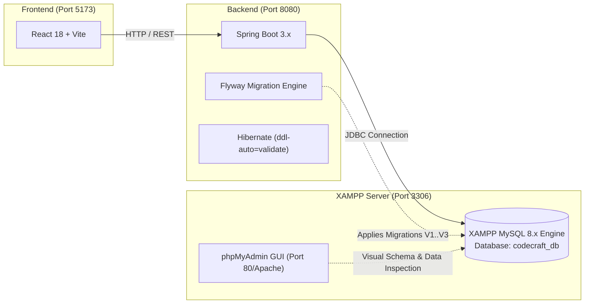
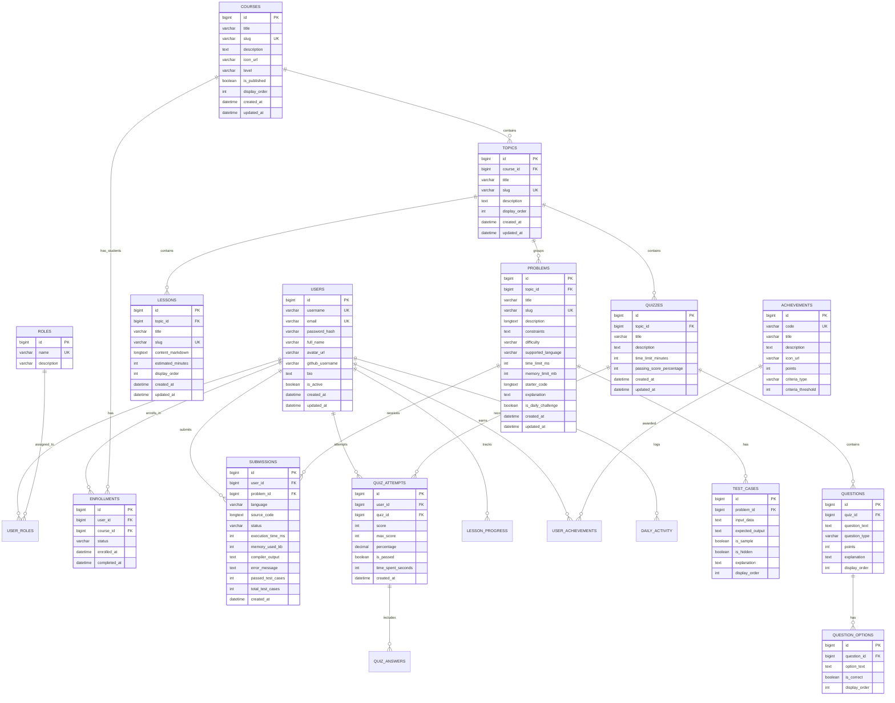

# CodeCraft — Database Design, Schema & XAMPP Setup Guide

## 1. Local Database Environment (XAMPP MySQL)

> [!IMPORTANT]
> **CodeCraft uses XAMPP MySQL for local database development. MySQL is intentionally NOT containerized.**
> Developers manage the database locally using the XAMPP Control Panel and phpMyAdmin. Docker is optional and never required for MySQL.

---

## 2. Entity-Relationship (ER) Diagram

---

## 3. Detailed Table Specifications & Constraints

### 3.1 Authentication & Identity (`users`, `roles`, `user_roles`)
- **`users`**:
  - `id`: `BIGINT AUTO_INCREMENT PRIMARY KEY`
  - `username`: `VARCHAR(50) NOT NULL UNIQUE` (Index: `idx_users_username`)
  - `email`: `VARCHAR(100) NOT NULL UNIQUE` (Index: `idx_users_email`)
  - `password_hash`: `VARCHAR(255) NOT NULL`
  - `full_name`: `VARCHAR(100) NOT NULL`
  - `avatar_url`: `VARCHAR(255) NULL`
  - `github_username`: `VARCHAR(100) NULL`
  - `bio`: `TEXT NULL`
  - `is_active`: `BOOLEAN NOT NULL DEFAULT TRUE`
  - `created_at`: `DATETIME NOT NULL DEFAULT CURRENT_TIMESTAMP`
  - `updated_at`: `DATETIME NOT NULL DEFAULT CURRENT_TIMESTAMP ON UPDATE CURRENT_TIMESTAMP`
- **`roles`**:
  - `id`: `BIGINT AUTO_INCREMENT PRIMARY KEY`
  - `name`: `VARCHAR(50) NOT NULL UNIQUE` (`ROLE_STUDENT`, `ROLE_ADMIN`)
  - `description`: `VARCHAR(255) NULL`
- **`user_roles`**:
  - `user_id`: `BIGINT NOT NULL`, `FOREIGN KEY (user_id) REFERENCES users(id) ON DELETE CASCADE`
  - `role_id`: `BIGINT NOT NULL`, `FOREIGN KEY (role_id) REFERENCES roles(id) ON DELETE CASCADE`
  - `PRIMARY KEY (user_id, role_id)`

### 3.2 Courses, Enrollments & Lessons (`courses`, `enrollments`, `topics`, `lessons`, `lesson_progress`)
- **`courses`**:
  - `id`: `BIGINT AUTO_INCREMENT PRIMARY KEY`
  - `title`: `VARCHAR(150) NOT NULL`
  - `slug`: `VARCHAR(150) NOT NULL UNIQUE` (Index: `idx_courses_slug`)
  - `description`: `TEXT NOT NULL`
  - `icon_url`: `VARCHAR(255) NULL`
  - `level`: `VARCHAR(20) NOT NULL DEFAULT 'BEGINNER'` (`BEGINNER`, `INTERMEDIATE`, `ADVANCED`)
  - `is_published`: `BOOLEAN NOT NULL DEFAULT FALSE`
  - `display_order`: `INT NOT NULL DEFAULT 0`
  - `created_at`, `updated_at`: standard timestamps
- **`enrollments`**:
  - `id`: `BIGINT AUTO_INCREMENT PRIMARY KEY`
  - `user_id`: `BIGINT NOT NULL`, `FOREIGN KEY (user_id) REFERENCES users(id) ON DELETE CASCADE`
  - `course_id`: `BIGINT NOT NULL`, `FOREIGN KEY (course_id) REFERENCES courses(id) ON DELETE CASCADE`
  - `status`: `VARCHAR(20) NOT NULL DEFAULT 'ACTIVE'` (`ACTIVE`, `COMPLETED`, `DROPPED`)
  - `enrolled_at`: `DATETIME NOT NULL DEFAULT CURRENT_TIMESTAMP`
  - `completed_at`: `DATETIME NULL`
  - `UNIQUE KEY uk_user_course (user_id, course_id)`
  - Index: `idx_enrollment_user (user_id)`, `idx_enrollment_course (course_id)`
- **`topics`**:
  - `id`: `BIGINT AUTO_INCREMENT PRIMARY KEY`
  - `course_id`: `BIGINT NOT NULL`, `FOREIGN KEY (course_id) REFERENCES courses(id) ON DELETE CASCADE`
  - `title`: `VARCHAR(150) NOT NULL`
  - `slug`: `VARCHAR(150) NOT NULL UNIQUE`
  - `description`: `TEXT NULL`
  - `display_order`: `INT NOT NULL DEFAULT 0`
  - Index: `idx_topics_course_id`
- **`lessons`**:
  - `id`: `BIGINT AUTO_INCREMENT PRIMARY KEY`
  - `topic_id`: `BIGINT NOT NULL`, `FOREIGN KEY (topic_id) REFERENCES topics(id) ON DELETE CASCADE`
  - `title`: `VARCHAR(200) NOT NULL`
  - `slug`: `VARCHAR(200) NOT NULL UNIQUE`
  - `content_markdown`: `LONGTEXT NOT NULL`
  - `estimated_minutes`: `INT NOT NULL DEFAULT 10`
  - `display_order`: `INT NOT NULL DEFAULT 0`
  - Index: `idx_lessons_topic_id`
- **`lesson_progress`**:
  - `id`: `BIGINT AUTO_INCREMENT PRIMARY KEY`
  - `user_id`: `BIGINT NOT NULL`, `FOREIGN KEY (user_id) REFERENCES users(id) ON DELETE CASCADE`
  - `lesson_id`: `BIGINT NOT NULL`, `FOREIGN KEY (lesson_id) REFERENCES lessons(id) ON DELETE CASCADE`
  - `is_completed`: `BOOLEAN NOT NULL DEFAULT TRUE`
  - `completed_at`: `DATETIME NOT NULL DEFAULT CURRENT_TIMESTAMP`
  - `UNIQUE KEY uk_user_lesson (user_id, lesson_id)`

### 3.3 Coding Problems & Sandbox Evaluation (`problems`, `test_cases`, `submissions`)
- **`problems`**:
  - `id`: `BIGINT AUTO_INCREMENT PRIMARY KEY`
  - `topic_id`: `BIGINT NOT NULL`, `FOREIGN KEY (topic_id) REFERENCES topics(id) ON DELETE RESTRICT`
  - `title`: `VARCHAR(200) NOT NULL`
  - `slug`: `VARCHAR(200) NOT NULL UNIQUE` (Index: `idx_problems_slug`)
  - `description`: `LONGTEXT NOT NULL`
  - `constraints`: `TEXT NOT NULL` (e.g. `1 <= nums.length <= 10^4`)
  - `difficulty`: `VARCHAR(20) NOT NULL` (`EASY`, `MEDIUM`, `HARD`)
  - `supported_language`: `VARCHAR(50) NOT NULL DEFAULT 'JAVA'`
  - `time_limit_ms`: `INT NOT NULL DEFAULT 2000` (2.0s)
  - `memory_limit_mb`: `INT NOT NULL DEFAULT 256` (256MB)
  - `starter_code`: `LONGTEXT NOT NULL` (Java starter boilerplate code)
  - `explanation`: `TEXT NULL` (Editorial solution explanation)
  - `is_daily_challenge`: `BOOLEAN NOT NULL DEFAULT FALSE` (Problem of the Day)
  - Index: `idx_problems_difficulty`, `idx_problems_topic_id`, `idx_problems_daily (is_daily_challenge)`
- **`test_cases`**:
  - `id`: `BIGINT AUTO_INCREMENT PRIMARY KEY`
  - `problem_id`: `BIGINT NOT NULL`, `FOREIGN KEY (problem_id) REFERENCES problems(id) ON DELETE CASCADE`
  - `input_data`: `TEXT NOT NULL`
  - `expected_output`: `TEXT NOT NULL`
  - `is_sample`: `BOOLEAN NOT NULL DEFAULT FALSE` (Shown to student on UI)
  - `is_hidden`: `BOOLEAN NOT NULL DEFAULT FALSE` (Hidden test case for submission evaluation)
  - `explanation`: `TEXT NULL`
  - `display_order`: `INT NOT NULL DEFAULT 0`
  - Index: `idx_testcases_problem_id`
- **`submissions`**:
  - `id`: `BIGINT AUTO_INCREMENT PRIMARY KEY`
  - `user_id`: `BIGINT NOT NULL`, `FOREIGN KEY (user_id) REFERENCES users(id) ON DELETE CASCADE`
  - `problem_id`: `BIGINT NOT NULL`, `FOREIGN KEY (problem_id) REFERENCES problems(id) ON DELETE CASCADE`
  - `language`: `VARCHAR(30) NOT NULL DEFAULT 'JAVA'`
  - `source_code`: `LONGTEXT NOT NULL`
  - `status`: `VARCHAR(50) NOT NULL` (`ACCEPTED`, `WRONG_ANSWER`, `TIME_LIMIT_EXCEEDED`, `MEMORY_LIMIT_EXCEEDED`, `COMPILATION_ERROR`, `RUNTIME_ERROR`, `INTERNAL_ERROR`)
  - `execution_time_ms`: `INT NULL`
  - `memory_used_kb`: `INT NULL`
  - `compiler_output`: `TEXT NULL`
  - `error_message`: `TEXT NULL`
  - `passed_test_cases`: `INT NOT NULL DEFAULT 0`
  - `total_test_cases`: `INT NOT NULL DEFAULT 0`
  - `created_at`: `DATETIME NOT NULL DEFAULT CURRENT_TIMESTAMP`
  - Index: `idx_sub_user_problem (user_id, problem_id)`, `idx_sub_created_at (created_at)`

### 3.4 Quizzes & Question Banks (`quizzes`, `questions`, `question_options`, `quiz_attempts`)
- **`quizzes`**:
  - `id`: `BIGINT AUTO_INCREMENT PRIMARY KEY`
  - `topic_id`: `BIGINT NOT NULL`, `FOREIGN KEY (topic_id) REFERENCES topics(id) ON DELETE CASCADE`
  - `title`: `VARCHAR(150) NOT NULL`
  - `description`: `TEXT NULL`
  - `time_limit_minutes`: `INT NOT NULL DEFAULT 15`
  - `passing_score_percentage`: `INT NOT NULL DEFAULT 70`
- **`questions`**:
  - `id`: `BIGINT AUTO_INCREMENT PRIMARY KEY`
  - `quiz_id`: `BIGINT NOT NULL`, `FOREIGN KEY (quiz_id) REFERENCES quizzes(id) ON DELETE CASCADE`
  - `question_text`: `TEXT NOT NULL`
  - `question_type`: `VARCHAR(30) NOT NULL DEFAULT 'SINGLE_CHOICE'`
  - `points`: `INT NOT NULL DEFAULT 10`
  - `explanation`: `TEXT NULL`
  - `display_order`: `INT NOT NULL DEFAULT 0`
- **`question_options`**:
  - `id`: `BIGINT AUTO_INCREMENT PRIMARY KEY`
  - `question_id`: `BIGINT NOT NULL`, `FOREIGN KEY (question_id) REFERENCES questions(id) ON DELETE CASCADE`
  - `option_text`: `TEXT NOT NULL`
  - `is_correct`: `BOOLEAN NOT NULL DEFAULT FALSE`
  - `display_order`: `INT NOT NULL DEFAULT 0`
- **`quiz_attempts`**:
  - `id`: `BIGINT AUTO_INCREMENT PRIMARY KEY`
  - `user_id`: `BIGINT NOT NULL`, `FOREIGN KEY (user_id) REFERENCES users(id) ON DELETE CASCADE`
  - `quiz_id`: `BIGINT NOT NULL`, `FOREIGN KEY (quiz_id) REFERENCES quizzes(id) ON DELETE CASCADE`
  - `score`: `INT NOT NULL`
  - `max_score`: `INT NOT NULL`
  - `percentage`: `DECIMAL(5, 2) NOT NULL`
  - `is_passed`: `BOOLEAN NOT NULL`
  - `time_spent_seconds`: `INT NOT NULL`
  - `created_at`: `DATETIME NOT NULL DEFAULT CURRENT_TIMESTAMP`

### 3.5 Gamification & Activity (`achievements`, `user_achievements`, `daily_activity`)
- **`achievements`**:
  - `id`: `BIGINT AUTO_INCREMENT PRIMARY KEY`
  - `code`: `VARCHAR(50) NOT NULL UNIQUE` (`FIRST_JAVA_ACCEPTED`, `SOLVED_10_EASY`, `STREAK_7_DAYS`, `PERFECT_QUIZ`)
  - `title`: `VARCHAR(100) NOT NULL`
  - `description`: `VARCHAR(255) NOT NULL`
  - `icon_url`: `VARCHAR(255) NULL`
  - `points`: `INT NOT NULL DEFAULT 50`
  - `criteria_type`: `VARCHAR(50) NOT NULL`
  - `criteria_threshold`: `INT NOT NULL`
- **`user_achievements`**:
  - `id`: `BIGINT AUTO_INCREMENT PRIMARY KEY`
  - `user_id`: `BIGINT NOT NULL`, `FOREIGN KEY (user_id) REFERENCES users(id) ON DELETE CASCADE`
  - `achievement_id`: `BIGINT NOT NULL`, `FOREIGN KEY (achievement_id) REFERENCES achievements(id) ON DELETE CASCADE`
  - `unlocked_at`: `DATETIME NOT NULL DEFAULT CURRENT_TIMESTAMP`
  - `UNIQUE KEY uk_user_achievement (user_id, achievement_id)`
- **`daily_activity`**:
  - `id`: `BIGINT AUTO_INCREMENT PRIMARY KEY`
  - `user_id`: `BIGINT NOT NULL`, `FOREIGN KEY (user_id) REFERENCES users(id) ON DELETE CASCADE`
  - `activity_date`: `DATE NOT NULL`
  - `submission_count`: `INT NOT NULL DEFAULT 0`
  - `quiz_count`: `INT NOT NULL DEFAULT 0`
  - `lesson_count`: `INT NOT NULL DEFAULT 0`
  - `UNIQUE KEY uk_user_date (user_id, activity_date)`

---

## 4. Flyway Migration Versioning

Flyway migration scripts reside in `backend/src/main/resources/db/migration/`:
- `V1__init_schema.sql`: Core table creation, foreign keys, unique constraints, and indexes.
- `V2__seed_initial_roles_and_achievements.sql`: Base roles (`ROLE_STUDENT`, `ROLE_ADMIN`) and standard achievement badges.
- `V3__seed_course_data.sql`: Production seed data for Java fundamentals course, topics, markdown lessons, practice problems with test cases, and assessment quizzes.
