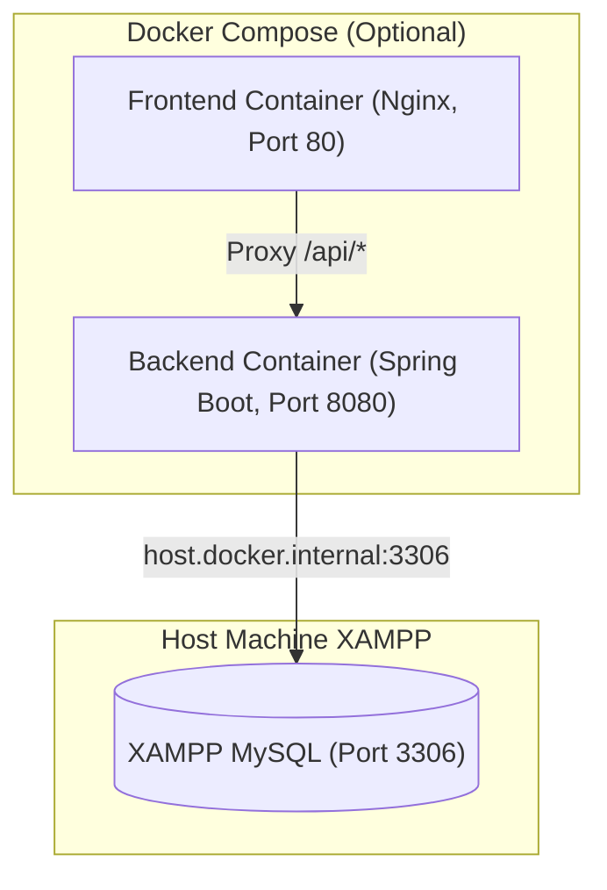

# CodeCraft — DevOps, Docker & Deployment Architecture

## 1. Local Development & Deployment Architecture

> [!IMPORTANT]
> **CodeCraft uses XAMPP MySQL for local database development. MySQL is intentionally NOT containerized.**
> Docker is strictly OPTIONAL and never required to run or test CodeCraft locally.
> 
> Standard local development setup:
> 1. Start XAMPP MySQL & Apache (phpMyAdmin)
> 2. Start Spring Boot backend (`./mvnw spring-boot:run`)
> 3. Start React frontend (`npm run dev`)

```mermaid
graph TD
    subgraph LocalMachine ["Developer Workstation"]
        subgraph FrontendDev ["Frontend (Port 5173)"]
            ViteDev["React 18 + Vite Dev Server"]
        end

        subgraph BackendDev ["Backend (Port 8080)"]
            SpringDev["Spring Boot 3.x Application"]
            FlywayDev["Flyway Migrations"]
        end

        subgraph XAMPPService ["XAMPP Server (Port 3306)"]
            XAMPPMySQL[("XAMPP MySQL 8.x\n(codecraft_db)")]
            phpMyAdmin["phpMyAdmin (Port 80)"]
        end
    end

    ViteDev -->|HTTP / REST (http://localhost:8080/api)| SpringDev
    SpringDev -->|JDBC (localhost:3306)| XAMPPMySQL
    FlywayDev -.->|Applies Migrations| XAMPPMySQL
    phpMyAdmin -.->|Manage & View DB| XAMPPMySQL
```

---

## 2. Optional Docker Compose Architecture (Non-Containerized MySQL)

If Docker is used to run the application services, **MySQL remains external on XAMPP**. The backend container connects to the host machine's XAMPP MySQL using `host.docker.internal`.



### Optional `docker-compose.yml` Specification (No MySQL Container)

```yaml
version: '3.8'

services:
  backend:
    build:
      context: ./backend
      dockerfile: Dockerfile
    container_name: codecraft-backend
    restart: unless-stopped
    extra_hosts:
      - "host.docker.internal:host-gateway" # Resolves to host machine XAMPP MySQL
    environment:
      SPRING_PROFILES_ACTIVE: prod
      DB_HOST: host.docker.internal
      DB_PORT: 3306
      DB_NAME: ${DB_NAME:-codecraft_db}
      DB_USERNAME: ${DB_USERNAME:-root}
      DB_PASSWORD: ${DB_PASSWORD:-}
      JWT_SECRET: ${JWT_SECRET:-9a7f3c2e1d8b4a5f6e7d8c9b0a1f2e3d4c5b6a7f8e9d0c1b2a3f4e5d6c7b8a9}
      JWT_EXPIRATION_MS: ${JWT_EXPIRATION_MS:-86400000}
      CORS_ALLOWED_ORIGINS: ${CORS_ALLOWED_ORIGINS:-http://localhost,http://localhost:80,http://localhost:5173}
    ports:
      - "8080:8080"
    healthcheck:
      test: ["CMD", "wget", "-qO-", "http://localhost:8080/actuator/health"]
      interval: 15s
      timeout: 5s
      retries: 5

  frontend:
    build:
      context: ./frontend
      dockerfile: Dockerfile
    container_name: codecraft-frontend
    restart: unless-stopped
    depends_on:
      backend:
        condition: service_healthy
    ports:
      - "80:80"
```

---

## 3. Multi-Stage Dockerfiles (Optional Packaging)

### 3.1 Backend Dockerfile (`backend/Dockerfile`)
```dockerfile
# Stage 1: Build JAR using Maven
FROM maven:3.9.6-eclipse-temurin-21-alpine AS builder
WORKDIR /app
COPY pom.xml .
RUN mvn dependency:go-offline -B
COPY src ./src
RUN mvn clean package -DskipTests -B

# Stage 2: Minimal Distroless / Temurin JRE Runtime
FROM eclipse-temurin:21-jre-alpine
WORKDIR /app
RUN addgroup -S appgroup && adduser -S appuser -G appgroup
USER appuser
COPY --from=builder /app/target/*.jar app.jar
EXPOSE 8080
ENTRYPOINT ["java", "-XX:+UseG1GC", "-XX:MaxRAMPercentage=75.0", "-jar", "app.jar"]
```

### 3.2 Frontend Dockerfile (`frontend/Dockerfile`)
```dockerfile
# Stage 1: Build React SPA
FROM node:20-alpine AS builder
WORKDIR /app
COPY package*.json ./
RUN npm ci
COPY . .
RUN npm run build

# Stage 2: Nginx Web Server
FROM nginx:1.25-alpine
COPY --from=builder /app/dist /usr/share/nginx/html
COPY nginx.conf /etc/nginx/conf.d/default.conf
EXPOSE 80
CMD ["nginx", "-g", "daemon off;"]
```

---

## 4. Environment Variables Specification (`.env.example`)

```env
# ==========================================
# Database Configuration (XAMPP MySQL)
# ==========================================
DB_HOST=localhost
DB_PORT=3306
DB_NAME=codecraft_db
DB_USERNAME=root
DB_PASSWORD=

# ==========================================
# Spring Boot & JWT Configuration
# ==========================================
SERVER_PORT=8080
JWT_SECRET=a_very_long_secure_256_bit_cryptographic_key_for_codecraft_2026!
JWT_EXPIRATION_MS=86400000
CORS_ALLOWED_ORIGINS=http://localhost:5173,http://localhost:80

# ==========================================
# Code Execution Sandbox Configuration
# ==========================================
SANDBOX_PROVIDER=LOCAL
EXECUTION_TIMEOUT_MS=2000
MEMORY_LIMIT_MB=256
```

---

## 5. Local Quickstart (Zero-Docker Workflow)

1. **Start XAMPP**: Launch Apache and MySQL from the XAMPP Control Panel.
2. **Create Database**: Go to `http://localhost/phpmyadmin` and create `codecraft_db`.
3. **Start Backend**:
   ```bash
   cd backend
   ./mvnw spring-boot:run
   ```
4. **Start Frontend**:
   ```bash
   cd frontend
   npm run dev
   ```
5. **Access Application**:
   - Web App: `http://localhost:5173`
   - API Docs: `http://localhost:8080/swagger-ui/index.html`
   - Healthcheck: `http://localhost:8080/actuator/health`
