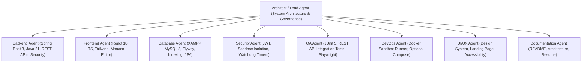

# CodeCraft — Development Roadmap, Agent Matrix & Governance

## 1. Phased Architecture & Release Roadmap (V1, V2, V3)

```mermaid
gantt
    title CodeCraft Engineering Release Roadmap
    dateFormat  X
    axisFormat %s

    section V1: Core Platform MVP
    Phase 0: Technical Design & Planning           :active, v1_p0, 0, 1
    Phase 1: Project Scaffolding & Setup           :v1_p1, 1, 2
    Phase 2: XAMPP Database, Entities & Migrations :v1_p2, 2, 3
    Phase 3: Auth, Security & JWT Engine           :v1_p3, 3, 4
    Phase 4: Landing Page, Courses & Enrollments   :v1_p4, 4, 5
    Phase 5: Java Coding Problems & Monaco Editor  :v1_p5, 5, 6
    Phase 6: Code Sandbox Abstraction & Submissions:v1_p6, 6, 7
    Phase 7: Quiz Engine & Problem of the Day      :v1_p7, 7, 8
    Phase 8: Student & Basic Admin Dashboards      :v1_p8, 8, 9

    section V2: Gamification & Polish
    Phase 9: AchievementService & Rule Engine      :v2_p9, 9, 10
    Phase 10: Activity Heatmap & Streaks (Real DB) :v2_p10, 10, 11
    Phase 11: Advanced Admin Authoring Suite       :v2_p11, 11, 12
    Phase 12: REST API Integration & E2E Testing   :v2_p12, 12, 13

    section V3: Hardening & Scale
    Phase 13: Optional Docker Sandbox Runner       :v3_p13, 13, 14
    Phase 14: Final Polish, Docs & Portfolio       :v3_p14, 14, 15
```

---

## 2. Release Scope Breakdown

### Version 1 (V1) — Core Platform MVP
- **Foundations**: Maven Java 21 Spring Boot 3 app, React 18 TypeScript Vite app, Tailwind CSS + shadcn/ui.
- **Database**: XAMPP MySQL `codecraft_db` (`localhost:3306`), Flyway migrations (`V1..V3`), `ddl-auto=validate`.
- **Auth**: User registration, login, stateless JWT, BCrypt, Spring Security 6 RBAC (`ROLE_STUDENT`, `ROLE_ADMIN`).
- **Landing Page**: Public landing page with hero, featured courses, interactive code preview, and Problem of the Day spotlight.
- **Courses & Enrollments**: Course catalog, `Enrollment` management, Topics, Markdown Lessons, completion tracking.
- **Coding Problems & Sandbox Engine**: Java 21 support first, problem details (constraints, starter code, time/memory limits, explanation), Monaco Editor, `CodeExecutionService` abstraction with safe local execution, dry-run evaluation, formal submission evaluation.
- **Quizzes**: Multiple choice quizzes with auto-grading and score calculation.
- **Dashboards**: Student and Admin basic dashboards with real statistics.

### Version 2 (V2) — Gamification, Analytics & Advanced Admin
- **Gamification**: Dedicated `AchievementService` executing event-driven achievement rules based on real activity data.
- **Streaks & Heatmap**: 365-day Activity Heatmap and streak calculation derived directly from database activity records.
- **Search & Filtering**: Multi-factor problem filtering (difficulty, topic, solved status) and search.
- **Admin Authoring**: Full authoring portal for courses, topics, lessons, coding challenges with public/hidden test cases, and quizzes.
- **Testing Suite**: Comprehensive REST API integration test suite (`MockMvc`) covering all controllers, security boundaries, and validation errors.

### Version 3 (V3) — Hardening & Sandbox Scaling
- **Containerized Sandbox**: Pluggable `DockerSandboxExecutionService` with ephemeral containers (`--network none`, `--memory 256m`, `--pids-limit 64`).
- **Multi-Language Architecture**: Framework to add Python/C++ runners onto the `CodeExecutionService` interface.
- **Optional Deployment**: Multi-stage Dockerfiles and optional `docker-compose.yml` connecting to host XAMPP MySQL.
- **Documentation**: Finalized Swagger UI, architecture walkthrough, and resume presentation.

---

## 3. Agent Responsibility Matrix (RACI)



---

## 4. Definition of Done (DoD) Checklist

A feature is considered **DONE** only when all of the following criteria are satisfied:
- [ ] **Backend Implemented**: REST Controller, Service, DTOs, and business logic complete.
- [ ] **Frontend Implemented**: Interactive UI connected to real backend API endpoints (zero mock data).
- [ ] **Database Integrated**: Entities mapped, Flyway migration script added, queries optimized for XAMPP MySQL.
- [ ] **Validation Enforced**: Jakarta Bean Validation on backend DTOs and Zod validation on frontend forms.
- [ ] **Error Handling**: Global exception handler returns structured `ErrorResponse` with zero stack trace leakage.
- [ ] **Security Enforced**: Endpoint authorized via Spring Security role checks (`@PreAuthorize`).
- [ ] **Automated Tests**: Unit and REST API integration tests written and passing.
- [ ] **UI States**: Loading skeleton, empty state, and toast feedback states implemented.
- [ ] **Zero Regressions**: Existing platform functionality remains functional.
- [ ] **Clean Code Standards**: No compiler warnings, no lint errors, no `System.out.println` statements.

---

## 5. Risk Register & Mitigation Strategy

| Risk ID | Risk Description | Severity | Probability | Mitigation Strategy |
| :--- | :--- | :--- | :--- | :--- |
| **RSK-01** | Student code executing malicious operations (RCE, fork bomb, infinite loop) | **CRITICAL** | Medium | Execute code in isolated sandbox with hard watchdog timer (2.0s), memory bounds (-Xmx256m), and output size caps (16KB). |
| **RSK-02** | XAMPP MySQL port 3306 conflict or missing `codecraft_db` | **MEDIUM** | Medium | Documented setup checklist in `docs/database.md`, `.env.example` defaults, and clear startup logs. |
| **RSK-03** | Premature optimization & architectural over-engineering | **HIGH** | Medium | Maintain clean, straightforward layered architecture (KISS + DRY + SOLID); avoid unnecessary microservice or event-bus complexity. |
| **RSK-04** | Large Monaco Editor bundle size | **MEDIUM** | High | Code splitting and dynamic lazy loading (`React.lazy`) for Monaco Editor components. |
| **RSK-05** | Real-time statistics performance under large data volume | **MEDIUM** | Low | Proper database indexing on `user_id`, `created_at`, `status`, and aggregate queries. |
