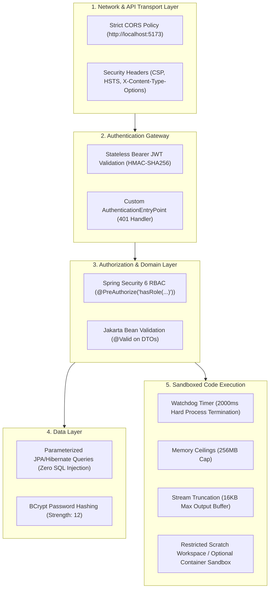
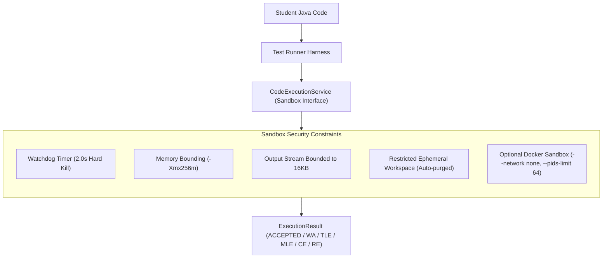

# CodeCraft — Security Architecture & Sandbox Isolation

## 1. Security Architecture Overview

CodeCraft implements **Defense-in-Depth**, enforcing security controls across transport, API authentication, business logic, persistence, and the isolated code execution sandbox.

---

## 2. Authentication & Authorization Lifecycle

1. **Password Security**: Passwords hashed with **BCrypt** with cost factor `12`.
2. **Stateless JWT**:
   - Signature: HMAC with SHA-256 (`HS256`).
   - Claims: User ID (`sub`), username, roles (`ROLE_STUDENT`, `ROLE_ADMIN`), issued at (`iat`), expiration (`exp`).
   - Expiration: Configurable via `JWT_EXPIRATION_MS` (default 24 hours in development).
3. **Role-Based Access Control**:
   - Public: `/api/auth/**`, `/api/public/**`, `/swagger-ui/**`.
   - Student: `/api/enrollments/**`, `/api/lessons/**`, `/api/submissions/**`, `/api/quizzes/**`, `/api/progress/**`.
   - Admin: `/api/admin/**` (strictly enforced via `@PreAuthorize("hasRole('ADMIN')")`).

---

## 3. Code Execution Sandbox Security Specification

Executing arbitrary user Java code introduces attack vectors including Remote Code Execution (RCE), Infinite Loops, Fork Bombs, and Memory Bloat. CodeCraft enforces strict containment rules.

### 3.1 Security Constraints Enforced:
1. **Compilation Isolation**: Code compiled in a clean, temporary scratch directory with `javac`. Compilation errors are captured and returned cleanly without exposing host system paths.
2. **Execution Watchdog**: An asynchronous watchdog thread kills the runtime process if execution exceeds the problem's `time_limit_ms` (default 2000ms), returning `TIME_LIMIT_EXCEEDED`.
3. **Memory Ceilings**: Java VM memory ceiling clamped via `-Xmx256m` (or problem `memory_limit_mb`).
4. **Buffer Truncation**: Standard output and error streams are capped at 16KB to prevent denial of service via `System.out.print` flood.
5. **Clean Abstraction**: The execution engine implements `CodeExecutionService`, allowing seamless switching between local process sandbox and containerized Docker sandbox without altering domain code.
