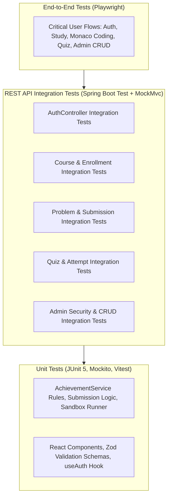

# CodeCraft — Testing Strategy & Quality Assurance Plan

## 1. Testing Pyramid Overview

CodeCraft implements a multi-tier testing strategy with a strong emphasis on **REST API Integration Testing**, business logic unit testing, and full-stack browser E2E validation.



---

## 2. REST API Integration Testing Suite

Integration tests verify end-to-end HTTP request processing, DTO validation, service orchestration, database persistence, and Spring Security authorization.

| Integration Test Suite | Covered Endpoints & Scenarios |
| :--- | :--- |
| **`AuthControllerIntegrationTest`** | Registration, Login, Bad Credentials (401), Validation Errors (400), Token Refresh, `/api/auth/me`. |
| **`CourseControllerIntegrationTest`** | List courses, View syllabus, Topic navigation, Markdown lesson retrieval, Mark lesson complete. |
| **`EnrollmentControllerIntegrationTest`** | Student course enrollment, Duplicate enrollment handling, List active enrollments. |
| **`ProblemControllerIntegrationTest`** | Catalog pagination, Difficulty filtering, Problem of the Day retrieval, Sample test cases. |
| **`SubmissionControllerIntegrationTest`** | Dry-run code execution (`/api/submissions/run`), Full code submission (`/api/submissions`), Submission history retrieval. |
| **`QuizControllerIntegrationTest`** | Fetch quiz (verify answers hidden), Submit quiz answers, Verify automated grading & score computation. |
| **`ProgressControllerIntegrationTest`** | Dashboard metrics aggregation from real DB records, Activity heatmap, Unlocked achievements. |
| **`AdminControllerIntegrationTest`** | Role verification: `ROLE_STUDENT` receives 403 Forbidden; `ROLE_ADMIN` can create courses, problems, and test cases. |

---

## 3. Backend Unit Testing (JUnit 5 + Mockito)

- **`AchievementServiceTest`**: Verify rule evaluation when criteria are met (first Java submission accepted, 7-day streak, perfect quiz score) and ensure no duplicate unlocks.
- **`CodeExecutionServiceTest`**: Test compilation errors, successful Java runs, timeout detection, and memory bounding.
- **`SubmissionServiceTest`**: Verify status determination logic (`ACCEPTED`, `WRONG_ANSWER`, `TIME_LIMIT_EXCEEDED`, `COMPILATION_ERROR`).
- **`QuizServiceTest`**: Verify percentage calculation, threshold pass/fail check, and score aggregation.

---

## 4. Frontend Component & E2E Testing

### 4.1 Frontend Component Tests (Vitest + React Testing Library)
- Form validation (Zod schema tests on registration and login).
- Monaco Editor wrapper initialization and code modification handlers.
- Interactive Quiz player timer and answer selection state.
- Problem of the Day spotlight card rendering.

### 4.2 Playwright End-to-End (E2E) Test Suite
1. **Public Landing Page & Auth Flow**: Visit `/`, view Problem of the Day spotlight, register new account, log in, verify redirect to `/app/dashboard`.
2. **Course & Lesson Flow**: Browse course catalog, enroll in Java course, read lesson, mark as complete.
3. **Coding Challenge Flow**: Open problem, write Java solution in Monaco Editor, click "Run Code" (dry-run), click "Submit Code", verify `ACCEPTED` badge and execution metrics.
4. **Quiz Assessment Flow**: Open topic quiz, answer questions before timer expires, submit, inspect score and answer explanations.
5. **Admin Content Flow**: Log in as Admin, create a new coding problem with test cases, verify student can solve the new problem.

---

## 5. Test Execution Commands

```bash
# Run all Backend Unit and Integration Tests
cd backend
./mvnw clean test

# Run Frontend Component Tests
cd frontend
npm run test

# Run Playwright End-to-End Tests
cd frontend
npx playwright test
```
